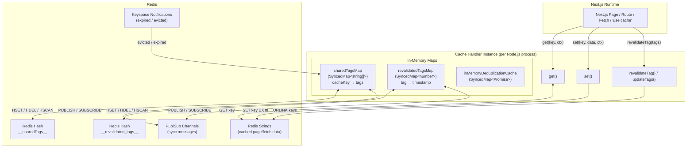
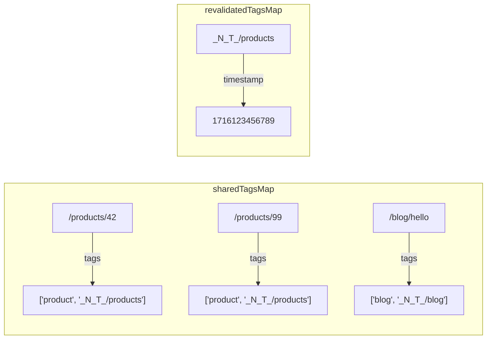
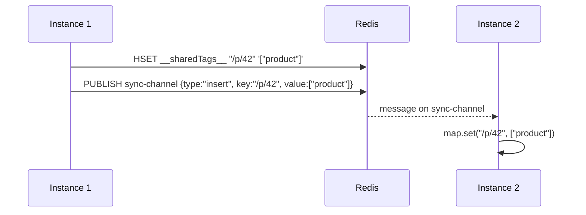
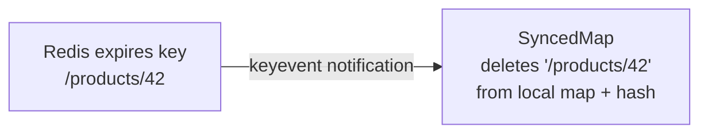
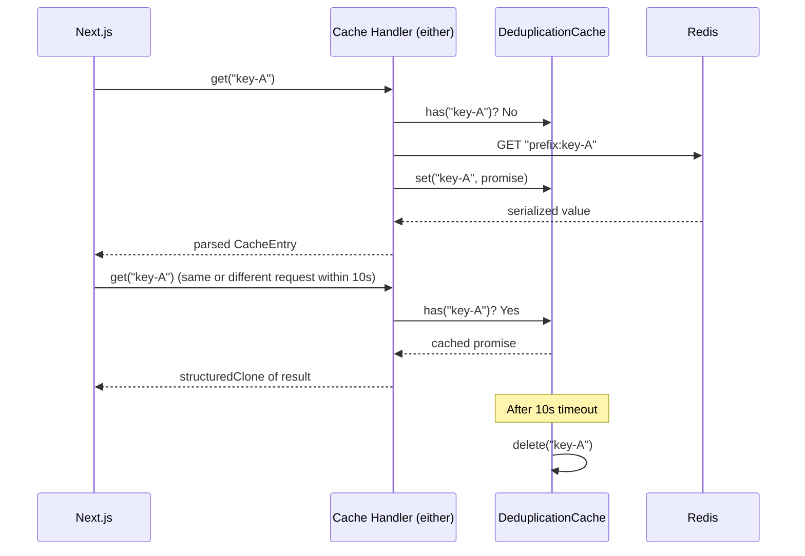
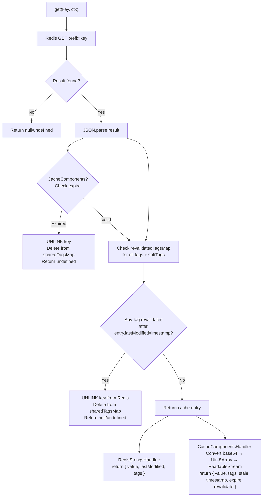
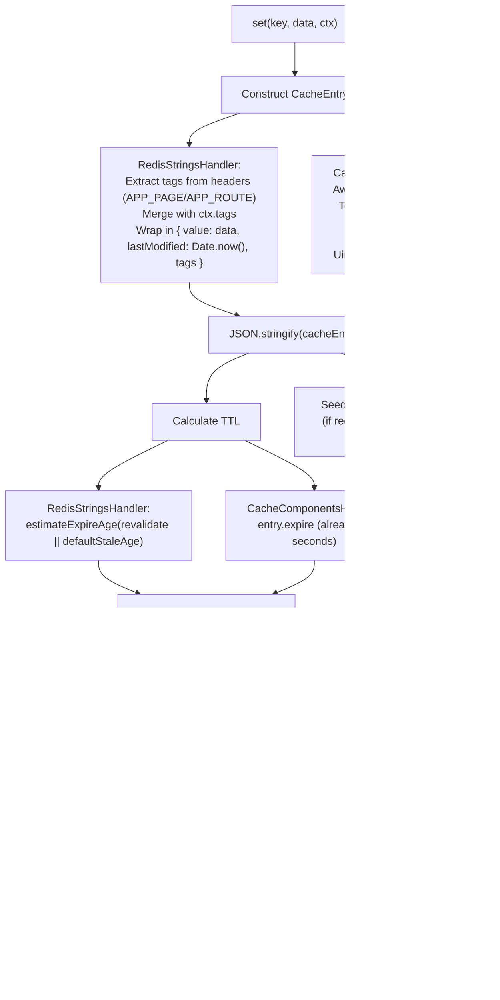
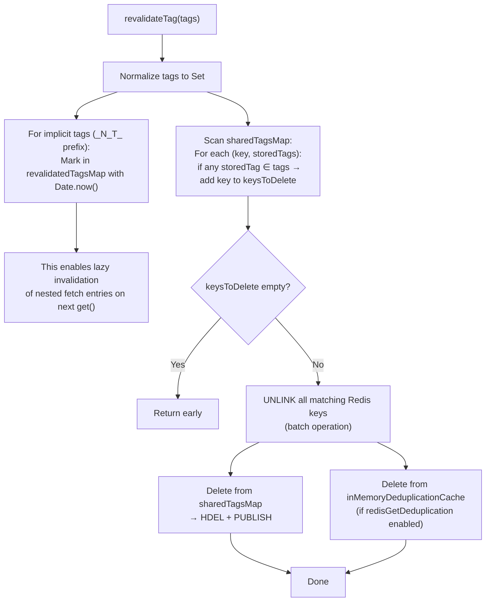
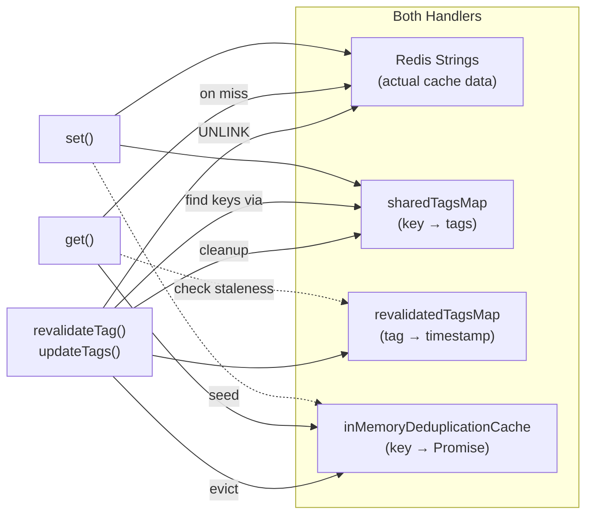

# Architecture – Cache Handler Logic

This document describes the internal architecture of the cache handler, focusing on the three core functions (`get`, `set`, `revalidateTag` / `updateTags`), the shared hash maps, and the supporting infrastructure (`SyncedMap`, `DeduplicatedRequestHandler`).

Two handler implementations exist side by side:

| Handler                    | Next.js API                                            | File                            |
| -------------------------- | ------------------------------------------------------ | ------------------------------- |
| **RedisStringsHandler**    | Legacy `cacheHandler` (Next.js 15)                     | `src/RedisStringsHandler.ts`    |
| **CacheComponentsHandler** | `cacheHandlers.default` (Next.js 16+ Cache Components) | `src/CacheComponentsHandler.ts` |

Both follow the same fundamental pattern – store serialized data in Redis strings, maintain two in-memory hash maps for tags, and synchronize those maps across instances – but differ in the data shapes they receive from Next.js and in some performance optimizations.

---

## Table of Contents

1. [High-Level Overview](#high-level-overview)
2. [Shared Hash Maps & Why They Exist](#shared-hash-maps--why-they-exist)
3. [SyncedMap – The Synchronization Primitive](#syncedmap--the-synchronization-primitive)
4. [DeduplicatedRequestHandler](#deduplicatedrequesthandler)
5. [Core Function: `get`](#core-function-get)
6. [Core Function: `set`](#core-function-set)
7. [Core Function: `revalidateTag` / `updateTags`](#core-function-revalidatetag--updatetags)
8. [RedisStringsHandler vs CacheComponentsHandler](#redisstringshandler-vs-cachecomponentshandler)

---

## High-Level Overview



---

## Shared Hash Maps & Why They Exist

### The Problem

Next.js calls `revalidateTag("product")` with **only the tag name**. It does **not** provide the list of cache keys that belong to that tag.

At the same time:

- Redis strings (the actual cache entries) are keyed by a cache key (e.g. `/products/[id]`), not by tag.
- Redis has no native secondary index that maps a tag to all keys that carry it.

Without an additional data structure, the only way to find all keys for a tag would be a `KEYS *` or `SCAN` over the entire keyspace, parsing every entry – far too expensive at scale.

### The Solution: Two SyncedMaps

| Map                  | Key                             | Value                | Purpose                                                                                                                |
| -------------------- | ------------------------------- | -------------------- | ---------------------------------------------------------------------------------------------------------------------- |
| `sharedTagsMap`      | cache key (e.g. `/products/42`) | `string[]` of tags   | Reverse index: given a tag, iterate this map to find all affected cache keys                                           |
| `revalidatedTagsMap` | tag name (e.g. `product`)       | `number` (timestamp) | Tracks _when_ a tag was last revalidated, used for lazy invalidation of fetch entries (implicit tags / `_N_T_` prefix) |

Both maps live **in-memory** in every Node.js process and are **synchronized across instances** through Redis Hash + Pub/Sub (see [SyncedMap](#syncedmap--the-synchronization-primitive)).



When `revalidateTag("product")` is called, the handler iterates `sharedTagsMap` to find `/products/42` and `/products/99`, then batch-deletes them from Redis in a single `UNLINK` call.

---

## SyncedMap – The Synchronization Primitive

`SyncedMap<V>` (`src/SyncedMap.ts`) wraps a standard `Map<string, V>` and keeps it synchronized across all Node.js processes via three mechanisms:

### 1. Redis Hash (persistent state)

Every `set()` writes to both the local map **and** a Redis Hash (`HSET`). On startup, `initialSync()` uses `HSCAN` to load the full hash into memory. A periodic re-sync (default ~1 hour, jittered) guards against drift.

### 2. Pub/Sub (real-time cross-instance sync)

Every `set()` and `delete()` also publishes a message on a dedicated channel. All other instances subscribe and apply the change to their local map immediately. This avoids the need for polling.



### 3. Keyspace Notifications (eviction / expiry cleanup)

When Redis evicts or expires a cache key, the corresponding entry must be removed from the `sharedTagsMap` as well – otherwise the map would grow indefinitely. `SyncedMap` subscribes to `__keyevent@<db>__:evicted` and `__keyevent@<db>__:expired` and automatically deletes matching entries.

This requires Redis to be configured with `notify-keyspace-events Exe`.



### Why not store tags inside the Redis string value?

The tag information _is_ stored inside the cached entry value as well. However, during `revalidateTag`, the handler must find _all_ keys that have a given tag without deserializing every cache entry. The in-memory `sharedTagsMap` enables O(n) iteration over a lightweight map instead of O(n) deserialization of potentially large page payloads.

---

## DeduplicatedRequestHandler

`DeduplicatedRequestHandler<T, K>` (`src/DeduplicatedRequestHandler.ts`) is a generic request deduplication + short-lived in-memory cache wrapper. It is used by **both** `RedisStringsHandler` and `CacheComponentsHandler`.

### Motivation

In a single Next.js request, the same cache key can be read multiple times (e.g. layout + page + multiple fetch calls referencing the same data). Without deduplication, each `get()` would issue a separate `Redis GET`. With deduplication:

1. The first call creates the Redis request promise and stores it in the `inMemoryDeduplicationCache`.
2. Subsequent calls for the same key within the caching window (default 10s) return the stored promise.
3. After the caching timeout, the entry is evicted.

### Seed on Set

When `set()` stores a value in Redis, it also **seeds** the deduplication cache with the serialized value. This means an immediately following `get()` is served from memory without hitting Redis at all.



The `inMemoryDeduplicationCache` itself is a `SyncedMap` configured with `withoutRedisHashmap: true` and `withoutSetSync: true` – it only uses the Pub/Sub delete channel so that revalidations on other instances can evict stale entries.

---

## Core Function: `get`

### What Next.js Passes In

**RedisStringsHandler:**

```typescript
get(key: string, ctx: {
  kind: 'APP_ROUTE' | 'APP_PAGE' | 'FETCH';
  tags?: string[];         // explicit tags (FETCH only)
  softTags?: string[];     // implicit tags like _N_T_/path (FETCH only)
  revalidate?: number;     // FETCH only
  fetchUrl?: string;       // FETCH only
  isFallback: boolean;
})
```

**CacheComponentsHandler:**

```typescript
get(cacheKey: string, softTags: string[])
```

The Cache Components interface is simpler: it receives only the cache key and soft tags (implicit tags for lazy invalidation).

### What `get` Does



### Key Details

1. **Timeout**: Every `Redis GET` uses `AbortSignal.timeout(getTimeoutMs)` (default 500ms). If Redis is slow, the handler returns `null` so the page can be server-rendered instead of waiting.

2. **Deduplication** (both handlers): Before hitting Redis, the deduplication cache is checked for an existing in-flight or recently resolved promise for the same key. Enabled by default (`redisGetDeduplication: true`) with a 10s caching window (`inMemoryCachingTime: 10_000`).

3. **Lazy tag invalidation**: Instead of eagerly deleting all fetch entries when a page tag is revalidated, the handler records the revalidation timestamp in `revalidatedTagsMap`. During `get`, it compares `lastModified` / `timestamp` against the max revalidation timestamp of all related tags. If the entry is stale, it is deleted and `null` is returned. This is necessary because `revalidateTag` for implicit tags (`_N_T_` prefix) does not know which fetch cache keys are affected.

4. **Value transformation** (CacheComponentsHandler): The stored value is a base64-encoded string (from a `ReadableStream<Uint8Array>`). On read, it is decoded back to `Uint8Array` and wrapped in a new `ReadableStream`.

---

## Core Function: `set`

### What Next.js Passes In

**RedisStringsHandler:**

```typescript
set(key: string, data: {
  kind: 'APP_PAGE' | 'APP_ROUTE' | 'FETCH';
  // APP_PAGE: { html, rscData, headers: { 'x-next-cache-tags', 'x-nextjs-stale-time' } }
  // APP_ROUTE: { body, status, headers: { 'x-next-cache-tags', 'cache-control' } }
  // FETCH: { data: { headers, body, status, url }, revalidate }
}, ctx: {
  tags?: string[];
  revalidate?: number | false;
  cacheControl?: { revalidate: number; expire: number };
})
```

**CacheComponentsHandler:**

```typescript
set(cacheKey: string, pendingEntry: Promise<{
  value: ReadableStream<Uint8Array>;
  tags: string[];
  stale: number;
  timestamp: number;
  expire: number;
  revalidate: number;
}>)
```

Note that the Cache Components handler receives a **Promise** of the entry – the value is not yet available when `set` is called.

### What `set` Does



### Key Details

1. **Tag extraction** (RedisStringsHandler): For `APP_PAGE` and `APP_ROUTE`, tags are encoded in the `x-next-cache-tags` header as a comma-separated string. The handler splits this and merges with `ctx.tags`.

2. **Tag deduplication**: Before writing to `sharedTagsMap`, both handlers check if the current tags are identical to the already stored tags. If so, the write is skipped to reduce Redis operations.

3. **Dedup cache seeding** (both handlers): The serialized value is immediately seeded into the `DeduplicatedRequestHandler`, so a following `get()` for the same key can be served from memory.

4. **Stream handling** (CacheComponentsHandler): The `ReadableStream` from Next.js is tee'd – one branch is consumed to produce the stored base64 value, while the original stream is left intact for Next.js to continue using.

5. **Parallel operations**: The Redis `SET` and the `sharedTagsMap.set()` run concurrently via `Promise.all`.

---

## Core Function: `revalidateTag` / `updateTags`

### What Next.js Passes In

**RedisStringsHandler:**

```typescript
revalidateTag(tagOrTags: string | string[])
```

**CacheComponentsHandler:**

```typescript
updateTags(tags: string[], durations?: { expire?: number })
```

In both cases, the handler receives **only tag names** – no cache keys.

### What `revalidateTag` / `updateTags` Does



### Key Details

1. **Implicit tags (`_N_T_` prefix)**: When Next.js calls `revalidatePath("/products")`, it internally translates this to `revalidateTag("_N_T_/products")`. The handler cannot know which _fetch_ cache keys are nested inside that page. Therefore, it only records the timestamp in `revalidatedTagsMap`. The actual cleanup happens lazily in `get()` when the fetch entry is next accessed.

2. **Batch deletion**: All matching Redis keys are deleted in a single `UNLINK` call (non-blocking Redis delete), minimizing network round-trips.

3. **Cross-instance propagation**: The `sharedTagsMap.delete()` publishes a Pub/Sub message, so all other instances immediately remove the deleted keys from their local maps as well.

4. **Dedup cache cleanup** (both handlers): Revalidated keys are also removed from the `inMemoryDeduplicationCache` to prevent stale data from being served from memory.

---

## RedisStringsHandler vs CacheComponentsHandler

| Aspect                    | RedisStringsHandler                                                              | CacheComponentsHandler                                                          |
| ------------------------- | -------------------------------------------------------------------------------- | ------------------------------------------------------------------------------- |
| **Next.js version**       | 15+ (legacy `cacheHandler`)                                                      | 16+ (`cacheHandlers.default`)                                                   |
| **Cache kinds**           | `APP_PAGE`, `APP_ROUTE`, `FETCH`                                                 | Unified (all via `'use cache'`, `cacheTag`, `cacheLife`)                        |
| **Value format**          | Arbitrary JSON (page HTML, RSC data, fetch response)                             | `ReadableStream<Uint8Array>` ↔ base64 string                                   |
| **Entry shape**           | `{ value, lastModified, tags }`                                                  | `{ value, tags, stale, timestamp, expire, revalidate }`                         |
| **set() receives**        | Resolved data                                                                    | `Promise<CacheComponentsEntry>` (may not yet be resolved)                       |
| **TTL calculation**       | `estimateExpireAge(revalidate)` – configurable function                          | `entry.expire` – passed directly by Next.js                                     |
| **Tag source in set**     | `x-next-cache-tags` header + `ctx.tags`                                          | `entry.tags`                                                                    |
| **Request deduplication** | Yes (`DeduplicatedRequestHandler`, default on)                                   | Yes (`DeduplicatedRequestHandler`, default on)                                  |
| **In-memory caching**     | Yes (configurable `inMemoryCachingTime`, default 10s)                            | Yes (configurable `inMemoryCachingTime`, default 10s)                           |
| **Revalidation function** | `revalidateTag(tagOrTags)`                                                       | `updateTags(tags, durations?)`                                                  |
| **Implicit tag handling** | Stores timestamp in `revalidatedTagsMap`, lazy check in `get()` for `FETCH` kind | Stores timestamp in `revalidatedTagsMap`, lazy check in `get()` for all entries |
| **Singleton pattern**     | External (user wraps in `module.exports`)                                        | Built-in `getRedisCacheComponentsHandler()` singleton                           |
| **Key prefix resolution** | `keyPrefix` option or `KEY_PREFIX` / `VERCEL_URL` env                            | `resolveKeyPrefix()` with BUILD_ID fallback                                     |

### Shared Architecture

Despite the API differences, the core invalidation architecture is identical:



Both handlers rely on `SyncedMap` for cross-instance consistency of the tag maps and use the same pattern of "find affected keys via `sharedTagsMap` → batch delete from Redis → clean up maps". Both also use `DeduplicatedRequestHandler` (enabled by default) to reduce Redis load by deduplicating concurrent `get()` calls for the same key and seeding the cache on `set()`.
